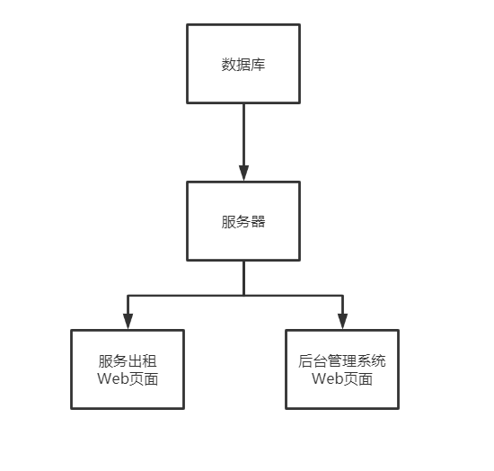
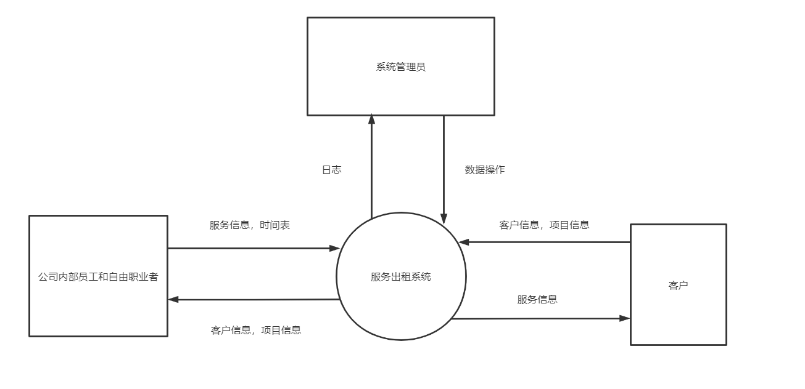
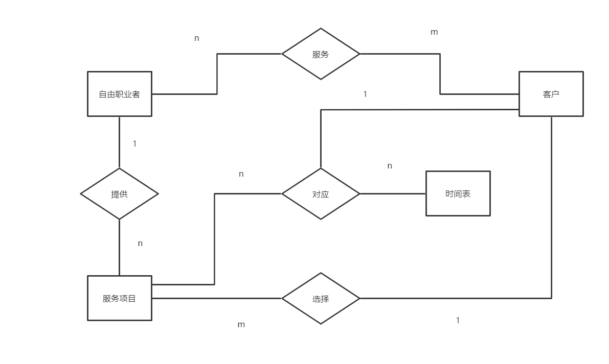
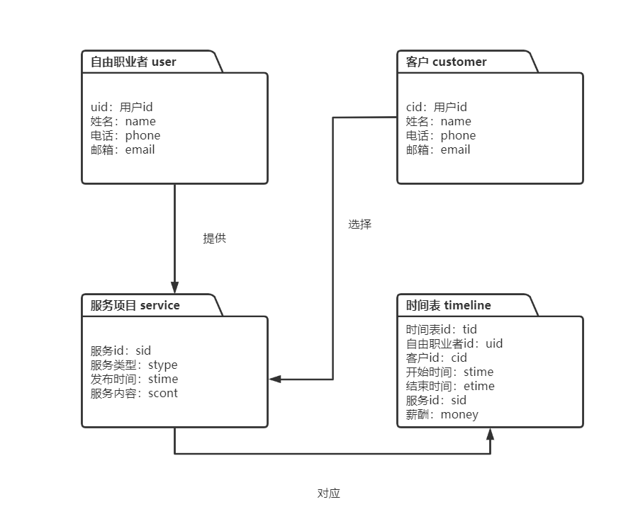
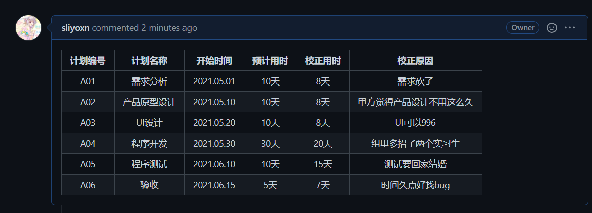
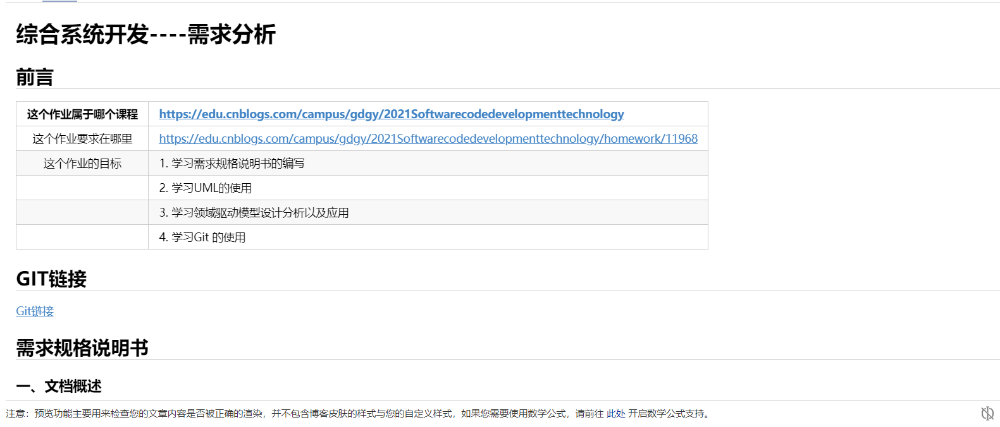

# 综合系统开发----需求分析

## 前言

|这个作业属于哪个课程|<https://edu.cnblogs.com/campus/gdgy/2021Softwarecodedevelopmenttechnology>|
|:-:|:--|
|这个作业要求在哪里|<https://edu.cnblogs.com/campus/gdgy/2021Softwarecodedevelopmenttechnology/homework/11968>|
|这个作业的目标|1. 学习需求规格说明书的编写|
||2. 学习UML的使用|
||3. 学习领域驱动模型设计分析以及应用|
||4. 学习Git 的使用|

## GIT链接

[Git链接](https://github.com/sliyoxn/ServiceRentalSystem)

## 需求规格说明书

### 一、文档概述

#### 1.1 目的和背景

一家公司提供服务出租，自身有一些员工，另外还有很多自由职业者作为服务商存在。公司目前使用Excel工作表来管理他们的客户（自由职业者），时间表等。Excel解决方案无法很好地进行扩展。它无法应对多用户使用的场景，也不提供安全和审计日志。因此他们决定构建一个新的基于Web的解决方案。

这篇文档用于定义相关的需求和模型

#### 1.2 对象

本系统的预期读者有：

- 开发组所有成员
- 测试组人员
- 开发公司的相关对接人员
- 开发公司授权调阅本文档的其他成员

### 二、需求概述

#### 2.1 项目概述

项目是一个基于Web的服务出租解决方案，名为《XX公司服务出租系统》

#### 2.2 需求概述

> 问题描述：一家公司提供服务出租，公司自身有一些员工，另外还有很多自由职业者作为服务商存在。公司目前使用Excel工作表来管理他们的客户（自由职业者），时间表等。Excel解决方案无法很好地进行扩展。它无法应对多用户使用的场景，也不提供安全和审计日志。因此他们决定构建一个新的基于Web的解决方案

需求列表

- 可以对`客户`，`时间表`，`公司内部员工`，`自由职业者`，`服务项目`进行增删查改
- 搜索自由职业者分类的功能
- 用于存储联系自由职业者的不同渠道的解决方案
- 搜索项目分类的功能
- 搜索客户分类的功能
- 维护合同中自由职业者的时间表
- 项目应该有一定的稳定性和安全性，可以允许一定程度的并发请求

#### 2.3 系统结构

### 三、系统功能需求

#### 3.1 数据流分析

- 0 层图

  

#### 3.2 实体联系模型

1. 实体及其属性

   |实体|属性|
   |:-:|:--|
   |自由职业者 / 职工|用户ID，姓名，电话，邮箱|
   |客户|客户ID，姓名，电话，邮箱|
   |服务项目|服务ID，服务类型，发布时间，服务内容|
   |时间表|时间表ID，自由职业者ID，客户ID，开始时间，结束时间，服务ID，对应薪酬|

1. 实体间联系

   - `自由职业者` 与 `客户` n 对 m；

   - `自由职业者` 与 `服务项目` 1 对 n；

   - `客户` 与 `服务项目` 1对 m;

   - `服务项目` 与 `时间表` n 对 m；

1. E-R 图

   

### 四、软硬件及外部系统接口需求

#### 4.1 运行环境和开发工具

1. 后端系统使用 `CentOS 7`。
1. 数据库使用 `MySQL v8.0.24`。
1. 后端使用`Java1.8`开发
1. 前端使用`Vue2.6`开发，兼容性情况如下

|  IE / Edge |  Firefox |  Chrome |  Safari |  Opera |
| :----------------------------------------------------------: | :----------------------------------------------------------: | :----------------------------------------------------------: | :----------------------------------------------------------: | :----------------------------------------------------------: |
|                           >= IE11                            |                       last 2 versions                        |                       last 2 versions                        |                       last 2 versions                        |                       last 2 versions                        |

### 五、其他需求

#### 5.1 安全性需求

1. 数据应该采用异地容灾备份，定时收到数据都通过 `rsync` 进行增量同步到数据容灾保存服务器。
1. 服务器要防止 DDOS、CSRF、重放等常见的攻击
1. 全站开启HTTPS，防止中间人攻击
1. 数据库应该防范SQL注入等常见的攻击
1. 前端需要注意XSS，CSRF攻击等常见的攻击

## 领域驱动设计

### 概念类

- 自由职业者
- 客户
- 服务项目
- 时间表

### 领域模型

## 项目计划

| 计划编号 |   计划名称   |  开始时间  | 预计用时 | 校正用时 |          校正原因          |
| :------: | :----------: | :--------: | :------: | :------: | :------------------------: |
|   A01    |   需求分析   | 2021.05.01 |   10天   |   8天    |          需求砍了          |
|   A02    | 产品原型设计 | 2021.05.10 |   10天   |   8天    | 甲方觉得产品设计不用这么久 |
|   A03    |    UI设计    | 2021.05.20 |   10天   |   8天    |         UI可以996          |
|   A04    |   程序开发   | 2021.05.30 |   30天   |   20天   |    组里多招了两个实习生    |
|   A05    |   程序测试   | 2021.06.10 |   10天   |   15天   |       测试要回家结婚       |
|   A06    |     验收     | 2021.06.15 |   5天    |   7天    |      时间久点好找bug       |

## 后台编辑截图

